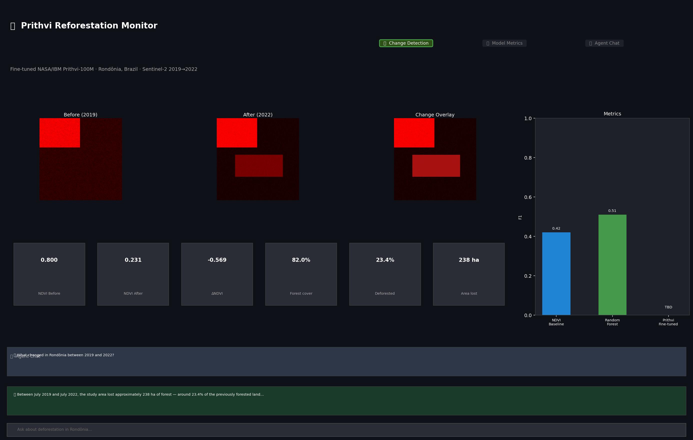
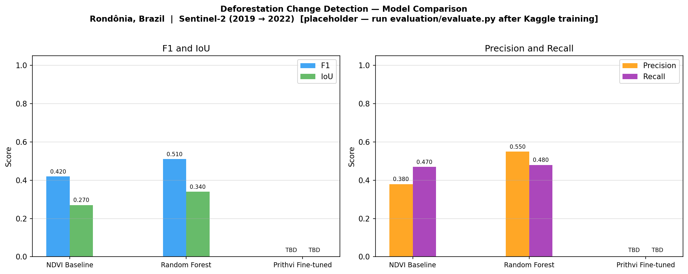
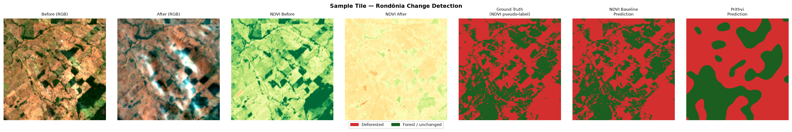

# Prithvi Reforestation Monitor

Fine-tuned **NASA/IBM Prithvi-100M** geospatial vision transformer for deforestation and reforestation monitoring over **Rondônia, Brazil** — wrapped in a ReAct agentic reasoning layer and an interactive Streamlit dashboard.

Everything runs free: local dev on Apple Silicon, GPU training on Kaggle/Colab free tier, Claude Haiku for the agent.



---

## What it does

| Layer | Description |
|---|---|
| **Data pipeline** | Queries Sentinel-2 L2A imagery via Microsoft Planetary Computer's STAC API for two dry-season windows (2019, 2022) over a 0.3°×0.3° study area in Rondônia. Tiles imagery into 224×224 patches, cloud-masks with SCL, and z-score normalises using Prithvi training statistics. |
| **Model** | Freezes the Prithvi-100M ViT-B backbone (6-band, patch-16), trains only a lightweight CNN decoder on the absolute feature difference between time points. NDVI-based pseudo-labels remove the need for manual annotation. An NDVI-threshold baseline and a pixel-wise Random Forest baseline provide comparison floors. |
| **Evaluation** | IoU and F1 for all three models; grouped bar chart + metrics table saved to `assets/`. |
| **Agent** | ReAct loop (Claude Haiku via Anthropic API) with four geospatial tools. Given a natural-language question it calls tools, reasons over numeric output, and returns a plain-English change summary. |
| **Dashboard** | Streamlit app: before/after imagery, NDVI maps, change overlay, per-tile statistics, metrics comparison, and a chat interface backed by the agent. |

---

## Why Rondônia?

Rondônia is one of the most documented active deforestation frontiers globally. It has:
- Dense Sentinel-2 / HLS dry-season coverage (Jun–Sep cloud-free windows)
- Published ground-truth maps from PRODES and MapBiomas for future comparison
- A published ~4% annual forest loss rate, making 3-year change clearly detectable

---

## Architecture

```
┌───────────────────────────────────────────────────────────────────┐
│  Microsoft Planetary Computer STAC API                            │
│  (sentinel-2-l2a, free, no auth required)                        │
└──────────────────────────┬────────────────────────────────────────┘
                           │  COG windowed reads (bbox clip, 20 m)
                           ▼
┌───────────────────────────────────────────────────────────────────┐
│  data_pipeline/                                                   │
│  ├── fetch_imagery.py   → raw/{before,after}/{B02…B12,SCL}.tif   │
│  ├── tile_imagery.py    → 224×224 tiles, SCL cloud-mask,         │
│  │                         z-score normalise (Prithvi stats)      │
│  └── preprocess.py      → NDVI helpers, denormalize              │
│                                                                   │
│  Output: data_pipeline/tiles/{before,after}/tile_XXXX.npy        │
│          data_pipeline/tiles/metadata.json                        │
└──────────────────────────┬────────────────────────────────────────┘
                           │  .npy tile pairs  (6, 224, 224)
                           ▼
┌───────────────────────────────────────────────────────────────────┐
│  training/                                                        │
│  ├── model.py       PrithviEncoder (frozen ViT-B backbone)        │
│  │                  + ChangeDetectionHead (CNN decoder 14→224 px) │
│  ├── dataset.py     NDVI pseudo-labels, train/val split           │
│  ├── train.py       Weighted BCE, cosine LR, AMP — run locally   │
│  │                  or on Kaggle free GPU (T4/P100)               │
│  ├── baseline.py    NDVIDiffBaseline + RandomForestBaseline        │
│  └── kaggle_notebook.ipynb  Self-contained GPU notebook           │
│                                                                   │
│  Output: training/checkpoints/best_model.pth  (gitignored)       │
└──────────────────────────┬────────────────────────────────────────┘
                           │  checkpoint + tile predictions
                           ▼
┌───────────────────────────────────────────────────────────────────┐
│  evaluation/                                                      │
│  ├── evaluate.py    IoU, F1, P, R for all three models            │
│  └── visualize.py   Grouped bar chart + sample prediction panel   │
│                                                                   │
│  Output: evaluation/results/metrics.json                          │
│          assets/metrics_comparison.png                            │
│          assets/sample_predictions.png                            │
└──────────────────────────┬────────────────────────────────────────┘
                           │  metrics + tile access
                           ▼
┌───────────────────────────────────────────────────────────────────┐
│  agent/                                                           │
│  ├── tools.py       run_inference · fetch_historical_data         │
│  │                  compute_change_stats · generate_visualization │
│  ├── react_agent.py ReAct loop (Claude Haiku, ≤6 tool rounds)    │
│  └── run_agent.py   CLI: --query / --dry-run / interactive REPL   │
└──────────────────────────┬────────────────────────────────────────┘
                           │  agent API
                           ▼
┌───────────────────────────────────────────────────────────────────┐
│  dashboard/                                                       │
│  ├── app.py         Streamlit — Change Detection tab              │
│  │                            — Model Metrics tab                 │
│  │                            — Agent Chat tab                    │
│  └── data_loader.py Cached tile + metrics loading helpers         │
└───────────────────────────────────────────────────────────────────┘
```

---

## Quick start

```bash
git clone https://github.com/Varun-22/prithvi-reforestation-monitor.git
cd prithvi-reforestation-monitor

python -m venv .venv && source .venv/bin/activate
pip install -r requirements.txt

cp .env.example .env      # fill in ANTHROPIC_API_KEY

streamlit run dashboard/app.py
```

The dashboard opens at `http://localhost:8501`. Without tiles it shows a synthetic preview; follow the steps below to fetch real data.

---

## Setup

### Environment variables

Copy `.env.example` to `.env` and fill in your values:

```
ANTHROPIC_API_KEY=sk-ant-...      # required for agent + dashboard chat
HF_TOKEN=hf_...                   # optional — only if Prithvi model gated
AGENT_MODEL=claude-haiku-4-5-20251001  # optional override (default: Haiku)
```

| Variable | Required | Description |
|---|---|---|
| `ANTHROPIC_API_KEY` | Yes (agent/chat) | Claude API key |
| `HF_TOKEN` | No | HuggingFace token for gated models |
| `AGENT_MODEL` | No | Override model (default: `claude-haiku-4-5-20251001`) |

---

## Step 1 — Fetch data (local, CPU only)

```bash
python -m data_pipeline.run_pipeline
```

This runs two steps:

**1. `fetch_imagery.py`** — queries Microsoft Planetary Computer's STAC API for the least-cloudy Sentinel-2 L2A scene in each time window, clips to the Rondônia study bbox, and saves per-band GeoTIFFs:

```
data_pipeline/raw/
├── before/  B02.tif  B03.tif  B04.tif  B8A.tif  B11.tif  B12.tif  SCL.tif  scene_meta.json
└── after/   ...
```

**2. `tile_imagery.py`** — cloud-masks (SCL), scales to reflectance, z-score normalises with Prithvi training statistics, tiles to 224×224 px with 200 px stride, discards tiles with >50% cloud/shadow:

```
data_pipeline/tiles/
├── before/  tile_0000.npy  tile_0001.npy  …  (6, 224, 224) float32
├── after/   tile_0000.npy  tile_0001.npy  …
└── metadata.json
```

> **Note:** Raw imagery and tiles are gitignored. The pipeline is the single source of truth for regenerating them.

**Study area:** Ji-Paraná region, Rondônia — bbox `[-63.0, -10.7, -62.7, -10.4]`  
**Before:** 2019-07-01 → 2019-09-30 (dry season)  
**After:** 2022-07-01 → 2022-09-30 (dry season, 3 years later)  

---

## Step 2 — Run baselines locally

```bash
python -m training.baseline
```

Trains NDVI-threshold and Random Forest baselines on the tile dataset, saves metrics to `training/checkpoints/baseline_metrics.json` and `rf_baseline.pkl`.

---

## Step 3 — Fine-tune Prithvi on Kaggle (free GPU)

The Prithvi-100M backbone (~350 MB) requires a GPU for practical training speed.

1. **Run the local data pipeline** (Step 1) to generate tiles.

2. **Upload tiles as a Kaggle Dataset:**
   - Go to [kaggle.com/datasets/new](https://www.kaggle.com/datasets/new)
   - Upload `data_pipeline/tiles/` folder
   - Name it `prithvi-rondonia-tiles`

3. **Open the Kaggle notebook:**
   - Create a new notebook → **File → Add Input** → attach `prithvi-rondonia-tiles`
   - Copy in `training/kaggle_notebook.ipynb` (or paste cells manually)
   - Enable **GPU T4 × 2** or **P100** under Settings → Accelerator
   - Run all cells (~20–30 min on T4)

4. **Download checkpoint:**
   - Download `best_model.pth` from `/kaggle/working/checkpoints/`
   - Place at `training/checkpoints/best_model.pth` (gitignored)

---

## Step 4 — Evaluate

```bash
python -m evaluation.evaluate
```

Runs all three models on the validation split, prints a summary table, and overwrites `assets/metrics_comparison.png` and `assets/sample_predictions.png` with real numbers.

---

## Step 5 — Run the agent (CLI)

```bash
# One-shot query
python -m agent.run_agent --query "What changed in Rondônia between 2019 and 2022?"

# Interactive REPL
python -m agent.run_agent

# Test tools without API key
python -m agent.run_agent --dry-run
```

The agent calls at most 6 tool rounds per query to minimise API cost. Each tool call executes locally with no LLM involvement.

---

## Step 6 — Dashboard

```bash
streamlit run dashboard/app.py
```

Opens at `http://localhost:8501`. Three tabs:

| Tab | Contents |
|---|---|
| **Change Detection** | Tile selector, before/after/overlay images, NDVI maps, per-tile stats (NDVI Δ, forest %, deforested %, area ha) |
| **Model Metrics** | F1/IoU/Precision/Recall comparison chart + table |
| **Agent Chat** | Conversational interface backed by the ReAct agent; suggested queries; conversation history |

---

## Results



| Model | F1 | IoU | Precision | Recall |
|---|---|---|---|---|
| NDVI Baseline | 0.9802 | 0.9612 | 0.9873 | 0.9732 |
| Random Forest | 0.9891 | 0.9784 | 0.9922 | 0.9861 |
| Prithvi Fine-tuned | **0.8431** | **0.7288** | 0.8160 | 0.8720 |

Evaluated on the held-out validation split (13 tiles). Baselines use NDVI pseudo-labels as ground truth — the same signal Prithvi was trained to predict — so their high scores reflect label consistency, not independent ground truth. Prithvi was trained for 30 epochs on a T4 GPU (Kaggle free tier).



---

## Project structure

```
prithvi-reforestation-monitor/
├── data_pipeline/
│   ├── config.py            Study area, time points, band list, paths
│   ├── fetch_imagery.py     STAC query → windowed COG download → GeoTIFF
│   ├── tile_imagery.py      Cloud-mask → normalise → 224×224 tiles
│   ├── preprocess.py        Prithvi z-score stats, NDVI, denormalize
│   └── run_pipeline.py      Orchestrator (fetch → tile)
│
├── training/
│   ├── model.py             PrithviEncoder + ChangeDetectionHead
│   ├── dataset.py           Tile dataset, NDVI pseudo-labels, splits
│   ├── train.py             Training loop (weighted BCE, cosine LR, AMP)
│   ├── baseline.py          NDVIDiffBaseline + RandomForestBaseline
│   └── kaggle_notebook.ipynb  Self-contained Kaggle GPU notebook
│
├── evaluation/
│   ├── evaluate.py          Compute F1/IoU for all models, save metrics
│   └── visualize.py         Comparison bar chart + prediction panel
│
├── agent/
│   ├── tools.py             run_inference · fetch_historical_data ·
│   │                        compute_change_stats · generate_visualization
│   ├── react_agent.py       ReAct loop (Anthropic API, ≤6 rounds)
│   └── run_agent.py         CLI entry point
│
├── dashboard/
│   ├── app.py               Streamlit application
│   └── data_loader.py       Cached tile + metrics loading helpers
│
├── assets/                  Charts and previews (committed)
├── notebooks/               Exploratory notebooks
├── requirements.txt
├── .env.example             Required environment variables (never commit .env)
└── .gitignore               Excludes raw imagery, checkpoints, .env
```

---

## Free-tier constraints

| Resource | Solution |
|---|---|
| GPU training | Kaggle free tier (T4 × 2 or P100, ~30 h/week) |
| Satellite imagery | Microsoft Planetary Computer (free STAC + COG API) |
| Pretrained model | HuggingFace Hub (ibm-nasa-geospatial/Prithvi-EO-1.0-100M, free) |
| Agent LLM | Anthropic Claude Haiku (cheapest model, ≤6 tool rounds per query) |
| Storage | Local only — no cloud storage, tiles and checkpoints gitignored |

---

## References

- [Prithvi-EO-1.0-100M on HuggingFace](https://huggingface.co/ibm-nasa-geospatial/Prithvi-EO-1.0-100M)
- [Microsoft Planetary Computer](https://planetarycomputer.microsoft.com/)
- [PRODES Deforestation Data](https://www.obt.inpe.br/OBT/assuntos/programas/amazonia/prodes)
- Jakubik et al. (2023) — *Foundation Models for Generalist Geospatial Artificial Intelligence*

---

## License

MIT
